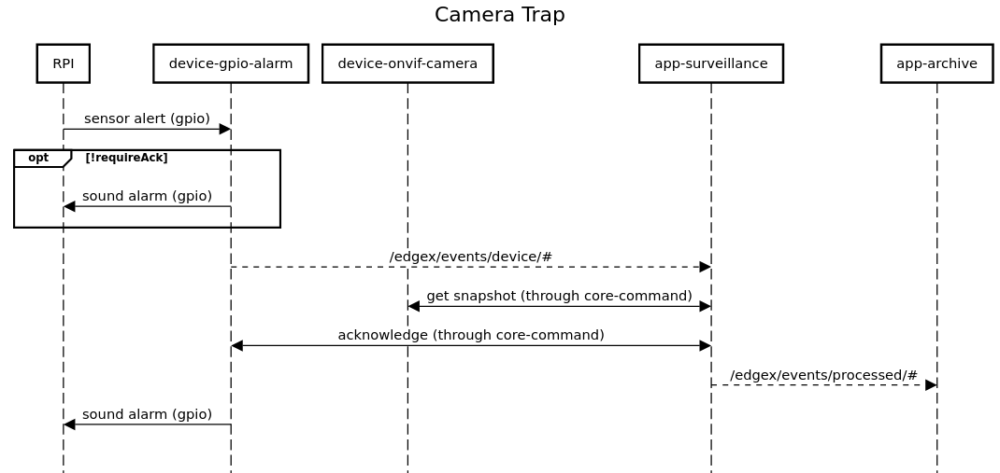

# Camera Trap

This application will implement a simple "camera trap" (also known as a game camera or trail cam).

In addition to the required EdgeX services it will use:

- [device-onvif-camera](https://github.com/edgexfoundry/device-onvif-camera)
- device-gpio-alarm
- app-surveillance
- app-archive

Of these device-onvif-camera is an EdgeX supported service, the rest are found in this folder.  This document will explain them briefly and the included `docker-compose.yml` will put them together to form the application.

## device-gpio-alarm

This EdgeX device service creates alerts based on GPIO sensor input.  It uses https://github.com/warthog618/gpiod and listens in 'pull up' mode so that it can get alerts onto the edgex message bus as soon as possible.

### commands

The only read command supported is `Alert`- same as the events pushed off.  Alerts will be for a configured duration and read commands will return true if one is active.

Write commands can be sent with a `Level` corresponding to the mapped alarm configuration and will sound the associated alarm if the alert is still active.  

note: If `RequireAck` is configured to true the alarm will not be triggered until acknowledgement is received (via a level PUT to "Alert" - if no level is provided a system configured default will be used)

## app-surveillance

This EdgeX application service will listen for alarms on the messagebus and capture a snapshot synchronously from the configured camera (via the core-command service) to append to the reading.  It will also acknowledge receipt of the alarm once the snapshot has been captured.

## app-archive

This EdgeX application service will sit at the end of the local messaging pipe and save image-enhanced alarms to a NATS KV store.  It will also provide an API for listing and viewing images associated with alerts in the archive.